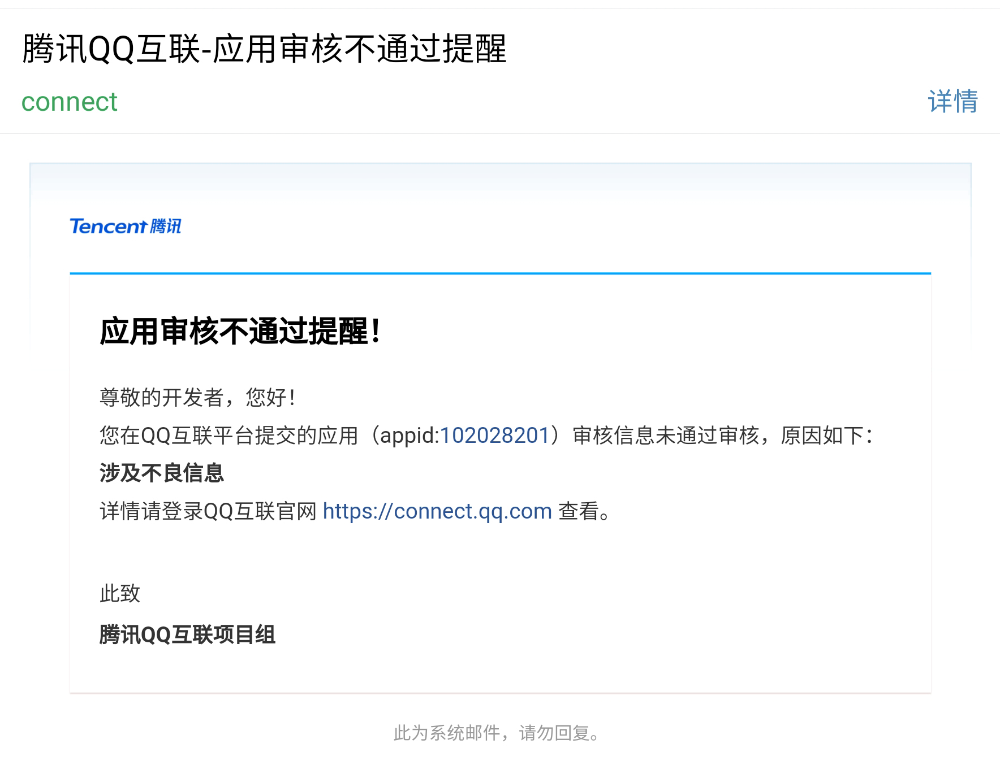
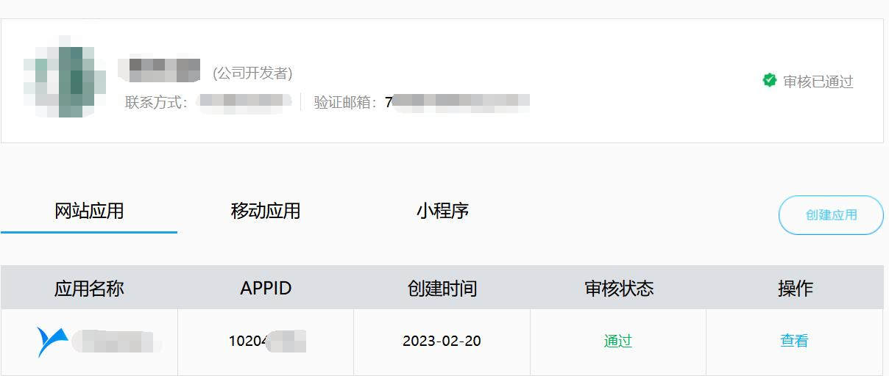

## QQ互联申请方案2.0

## 前言

* 本方案和源码是为网站已经有不少内容的站长解决后期申请QQ互联的问题

* 有内容的站点申请基本都是回复（涉及不良信息）

* 发送邮件至官方工作人员，回复也是没问题，请再申请或涉及不良信息

* 数据都改好之后，先再将QQ互联申请写好提交，再修改默认文档为.html优先

## 截图

## 预览

[点我预览](https://handyplus.github.io/QQInternetApplicationScheme2.0/)

## 使用说明

**1、将源码index.html和yuyun文件夹上传至根目录（一般不会影响内容列表页查看，只是暂时替换首页）**

**2、服务器默认文档由index.php修改为index.html（准确来说就是提高访问的文件后缀优先级）**

**3、修改index.html文件代码**

**4、找到18行的 `<title>登录 - 这里填写您的备案时填写的网站名称</title>` 修改成你备案时填写的名称**

**5、找到77行代码中的链接 `https://www.fk.xj.cn/oauth/qq?rurl=https%3A%2F%2Fwww.fk.xj.cn%2F`
（此步骤推荐改为你的互联登录地址，避免用户注册时成为我站用户）**

**6、找到86行 ` - 这里填写您的版权信息 版权所有.  ` 修改您的版全信息（个人备案写网站名称/企业备案就写公司名称）**

**7、找到87行 ``这里填写您的ICP备案号 填写您的ICP备案号注意是-1还是-其他数字**

**8、找到94行 `const txt = ["一个致力分享免费技术资源的团队", "感谢您使用本程序", "官网：www.fk.xj.cn"];` 可以修改左侧的打字内容**

**9、yuyun文件夹内是CSS、图标、和背景图片的文件夹可以修改为自己喜欢的，注意：通常使用的格式是png、jpg，请在代码中将.webp后缀改为你对于的格式后缀**

**10、左侧背景图片在 site.min.css 文件内的1284行 `background: url(./bg.webp);`处修改**

## 来源

[GITEE](https://gitee.com/Arow-Yella/QQInternetApplicationScheme2.0)